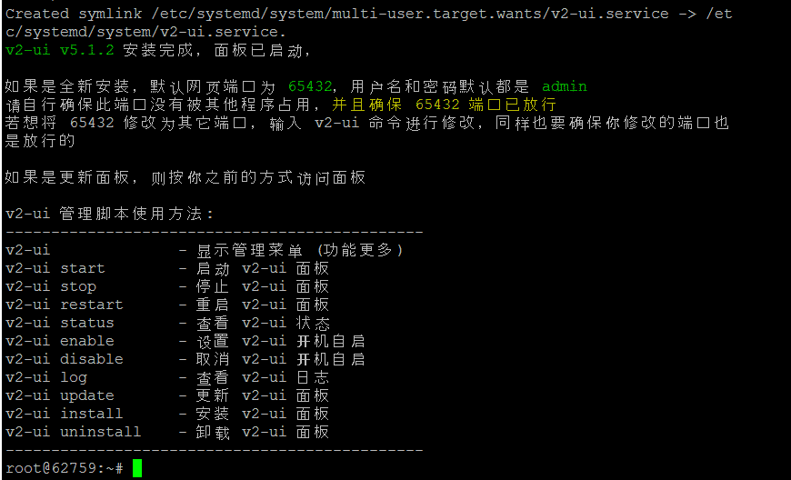

## اینترنت آزاد 
راهنمایی برای راه‌اندازی انواع VPN.
<details>
<summary><b>فهرست</b> (کلیک برای باز شدن)</summary>
<!-- MarkdownTOC -->

1. [خرید سرور)](#buy-vps)
1. [راه‌اندازی یک v2ray ساده با پنل x-ui](#setting-a-simple-v2ray-with-x-ui-panel)
1. [اتصال به v2ray](#connect-to-v2ray)
1. [منابع](#references)

<!-- /MarkdownTOC -->
</details>


## Buy VPS 
برای خرید یک سرور، شما باید:

* قبل از خرید سرور، مطمئن شوید که پینگ به سرور درست کار می‌کند.
* سرورهایی بخرید که هزینه‌ی آن‌ها ساعتی است
* از ارائه دهنده‌هایی خرید کنید که کمتر شناخته‌شده‌اند
* نظرات خریداران را بپرسید

سرویس‌دهنده‌های زیر پیشنهاد می‌شوند:

* [Vultr](https://www.vultr.com/) – hourly billing – starting from $3.5 per month – vultr.com (get a $100 bonus)
* [DigitalOcean](https://www.digitalocean.com/) – hourly billing – starting from $5 per month – digitalocean.com (get a $100 bonus) (You can use refer code to use free plans)
* [RackNerd](https://my.racknerd.com/) – monthly billing – starting from $2 per month (annual subscription) – racknerd.com

**در برخی از موارد که شما نمیتوانید مستقیم به اینترنت جهانی وصل شوید (اینترانت)، نیاز دارید تا یک سرور ایران بخرید که ترافیک را تونل کنید، همچنین می‌توانید سرورهایی از این سرویس‌دهنده‌ها بخرید که در اروپا قرار دارند که به علت امنیتی توصیه نمی‌شود.**

برخی از سرویس‌دهنده‌های ایرانی:
* [server](https://server.ir/)
* [sarv data](https://sarvdata.com/) 
* [pars dev](https://parsdev.com/vps/)
* [saba host](https://saba.host/virtual-server)
* [blue server](https://blueserver.ir/vps)
* [arvan cloud](https://www.arvancloud.com/) 

## Setting a simple v2ray with X-UI panel 
به واسطه‌ی این  [اسکریپت](https://github.com/vaxilu/x-ui), شما می‌توانید به راحتی از v2ray استفاده کنید، حتی برای این اتصال نیازی به دانش زیادی از لینوکس ندارید,  

سیستم عاملی که انتخاب می‌کنید باید یکی از موارد Ubuntun 16، Debian 8 و یا CentOS 7 (حداقل نسخه‌ها ذکر شده است) نیاز دارید. این آموزش بر اساس ابونتو است.


### install the script
1. ابتدا باید لینک‌های ریپازیتوری را آپدیت کنید و curl را نصب کنید
```
   sudo apt-get update -y 
   sudo apt-get upgrade -y
   sudo apt install curl -y 
```

2. دستور زیر را اجرا کنید

```
bash <(curl -Ls https://raw.githubusercontent.com/vaxilu/x-ui/master/install.sh)
```
برنامه نصب شده است و باید همچین تصویری را مشاهده کنید:



**ممکن است در هنگام نصب از شما سوالی بپرسد مبنی بر (آره یا نه) شما باید n را انتخاب کنید**

### Managing  v2ray
برای مدیریت کاربران، شما باید به پورت 54321 آیپی خود درخواست بزنید. به صورت پیش‌فرض رمز و کلمه‌ی عبور admin است(عوض کردن آن بهتر است).

```http://"your-ip-address":54321```

**زبان پنل، چینی است، شما می‌توانید با استفاده از [گوگل ترنزلیت](https://translate.google.com/) یا [دیپ‌ال](https://www.deepl.com) این پنل را ترجمه کنید**

برای افزودن یک کاربر، به بخش accounts بروید و بر روی دکمه‌ی + بزنید: صفحه‌ای نمایش داده می‌شود که با اطلاعات زیر پر کنید:

* Remark – here you can write anything you want
* Protocol – vmess
* Listening IP, Port, ID (UUID) and Alter ID generated automatically. You can change them manually. 
* Transport – ws (websocket)
* Path – you can leave it the way it is or add anything you want
* Turn off TLS
* Domain – write your domain name or sub-domain name (not for this part)
* You can choose certificate file path and copy the file paths, or copy the certificate and key directly to certificate file content (not for this part)
* Copy and paste certificate and key file paths, respectively (not for this part)
* Press “Add”

با این روش شما می‌توانید کاربران را ایجاد و مدیریت کنید. می‌توانید محدودیت زمان و مصرف نیز برای کاربران قرار دهید. همچنین با ترکیب کردن انواع حالات، می‌توانید وی ‌پی ان‌های مختلفی را بسازیدو.


### Speed up server 
در صورتی که حس کردید سرعت شما کم است می‌توانید دستور زیر را در ترمینال وارد کنید.
```
wget -N --no-check-certificate https://github.com/teddysun/across/raw/master/bbr.sh && chmod +x bbr.sh && bash bbr.sh
```

### Use bridge to connect
ممکن است شما به علت اینترنت ملی نتوانید مستقیم به سرور خارج وصل شوید و نیاز باشد که از یک سرور ایران استفاده کنید، با دستورات زیر می‌توانید درخواست‌ها را از سرور ایران عبور دهید:
(می‌توانید سایر بخش‌هارا استفاده کنید به جای این کار)

```
apt-get update -y && apt-get upgrade -y

sysctl net.ipv4.ip_forward=1
iptables -t nat -A PREROUTING -p tcp --dport 22 -j DNAT --to-destination IRAN_IP
iptables -t nat -A PREROUTING -j DNAT --to-destination EU_IP
iptables -t nat -A POSTROUTING -j MASQUERADE
```

## Connect to v2ray
v2ray apps for Android

You can use v2ray on several apps on Android, and all of them are available for free Google Play (You can download from [here](https://www.sudoer.ir/documents/), in case you can't access Google Play).

    v2RayNG
    NapsternetV
    Clash for Android
 
v2ray apps for iOS

You can use v2ray on several apps on your iPhone/iPad as well, most of the v2ray apps are paid apps, except for 91VPN.

    NapsternetV
    ShadowRocket
    Kitsunebi
    Quantumult
    i2Ray
    Pepi
    91VPN
    Pharos Pro
    FairVPN

v2ray clients for Windows

For your Windows PC, you can choose one of these five v2ray Windows clients. And here is a download link for the three of them. There are also new softwares called Clash (download it here) and Qv2ray (download it here).

    Nekoray 
    V2RayN
    V2RayW
    V2RayS
    Clash
    Qv2ray
    Netch

v2ray clients for macOS

For your Mac, you can choose one of these four v2ray clients. Here is a download link for V2RayX and here for V2RayU. The newsest additions to the list are ClashX (Click here to download) and Qv2ray (download it here) for macOS. 

    V2RayX
    V2RayU
    ClashX
    Qv2ray


## References
* [sudoer group](https://www.sudoer.ir)
* [privacymelon](https://privacymelon.com/how-to-setup-v2ray-ws-tls-cdn/)